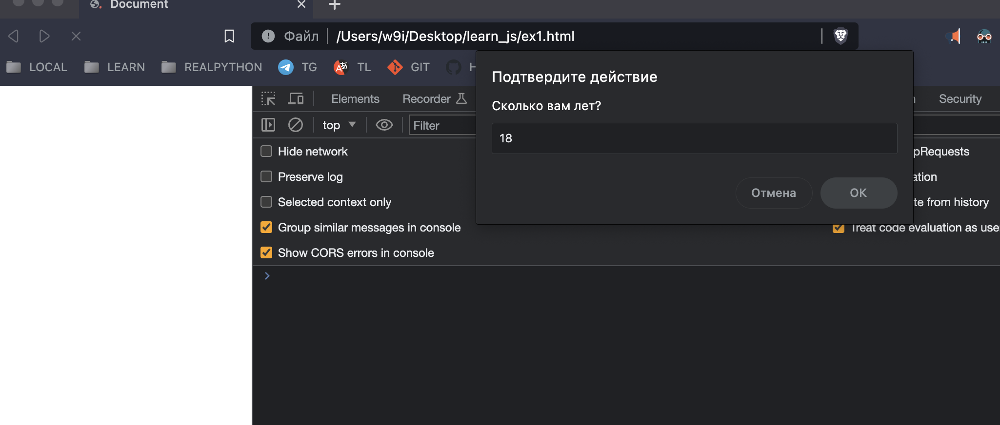
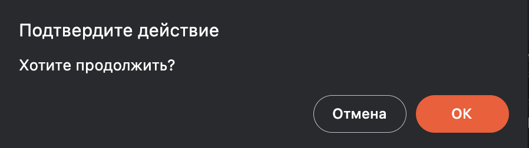
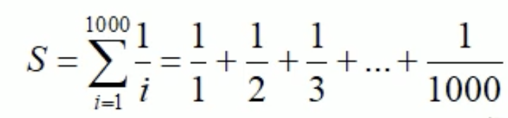
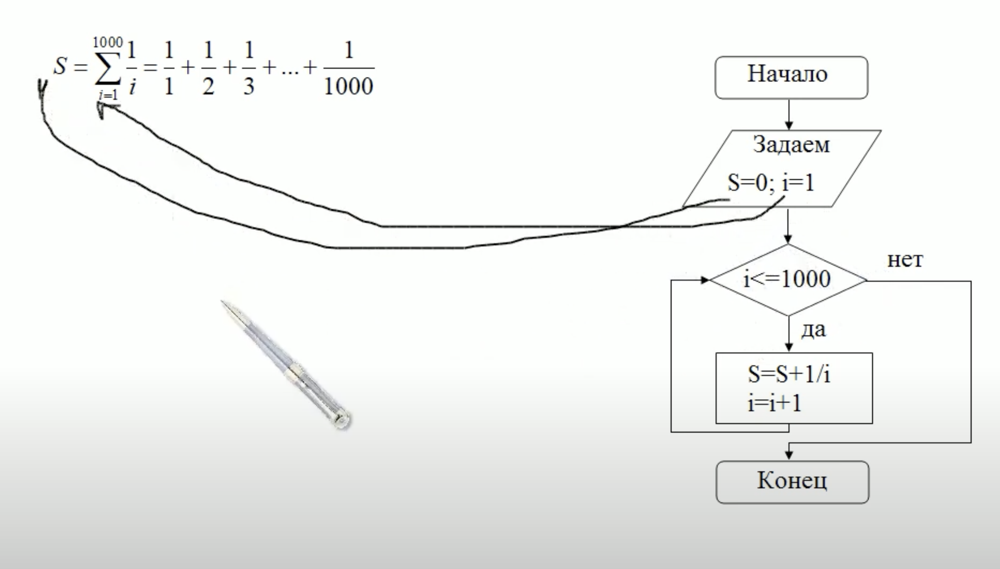
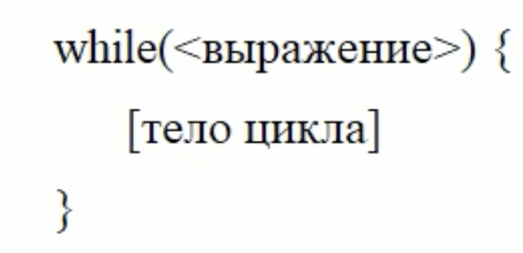
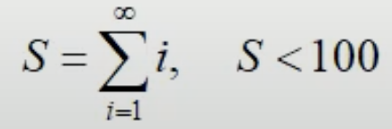
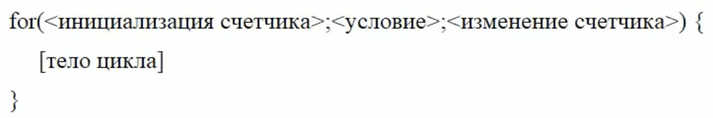
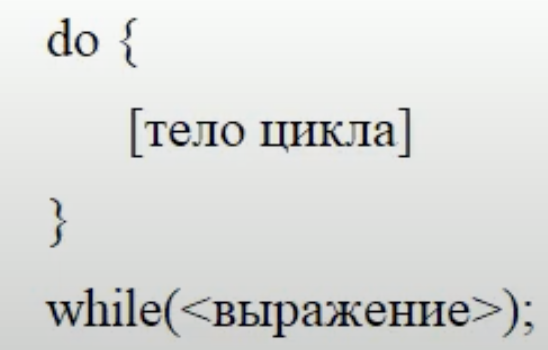
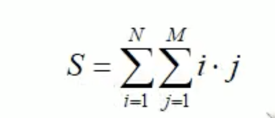

Чтобы указывать браузеру где находится `js`, мы должны указать в теге `body` следующее:
```html
<!DOCTYPE html>
<html>
<head>
    <title>Document</title>
</head>
<body>

    <script type="text/java">
        <!-- здесь пишем js код -->
    </script>

</body>
</html>
```
Атрибут `type="text/java"` был нужен для старых браузерах, теперь в современных браузерах необязательно его указывать:
```html
<!DOCTYPE html>
<html>
<head>
    <title>Document</title>
</head>
<body>

    <script>
        <!-- здесь пишем js код -->
    </script>

</body>
</html>
```
Тег `script` можно располагать или в теге `head` или в `body`, если мы размещаем тег `script` в `body`, то мы должны его разместить в конце тега `body`, чтобы скрипт отработал после того как загрузится вся страница.

Чтобы открыть консоль `CTRL+ALT+I`

Современным браузерам необходимо учитывать код написанный по стандартам как `ES6` так и `ES5`, если мы пишем код по новому стандарту (ES6), то лучше явно сообщить это браузеру, для этого нужно подключить директиву `"use strict"`.

В новых стандартах переменные объявляются следующим образом:
```js
let spam;
```

После объявления мы можем присвоить какое-то значение:
```
spam = 'ham';
```
Обратите внимание, что перед именем переменной мы не написали ключевое слово `let`, если раннее в программе переменная уже объявлена, то нет необходимости в этом ключевом слове.

Или мы можем сразу объявить и присвоить какое-то значение переменной, чтобы экономить средства выражения (отсылка к книга Гради Буч).
```js
let spam = 'ham';
```

Чтобы вывести переменную:
```js
console.log(spam);
```

Мы также можем объявить и присвоить значения нескольким переменным:
```js
"use strict";

let user = 'Alex', age=25, email='alex@mail.ru';

console.log(user, age, email);
```

Для читабельности можно перенести в новую строку эти переменные:
```js
"use strict";

let user = 'Alex',
    age=25,
    email='alex@mail.ru';

console.log(user, age, email);
```

Если мы объявим переменную, ничего не присвоем ей и попытаемся вывести в консоль, то получим сообщение `undefained`.

```js
"use strict";

let spam;

let user = 'Alex',
    age=25,
    email='alex@mail.ru';

console.log(spam, user, age, email);

// undefined 'Alex' 25 'alex@mail.ru'
```

Обратите внимание, что далее в программе мы можем переприсваивать именам другие значения (я не знаю ссылочная ли модель в джаваскрипт, но будем пока в наче использовать выражение `присваивать значения именам`). Если мы хотим, чтобы переменной не присваивалось никакое значение далее в программе, то нам необходимо объявить ее `константной`:
```js
const spam = 'ham';
spam = 'eggs'; // тут получим ошибку!
```

Когда мы объявляем переменную следующим образом:
```js
let a = 2;
```
то переменная `a` у нас имеет числовой тип (Number), анологично, если присвоим строку, то переменная а будет иметь тип (String).

Перечислим некоторые типы данных:
1. Числовой тип (number): обычные числа и числа с плавающей точкой
    - десятичный - целое число (например 0, 5, -10, 56)
    - приближенные к вещественным - приблизительные вещественные числа (например, 6.7, 8.54, -10.34)
    - экспоненциальный (научный) - с использованием буквы `e` (например, `10 = 1е1 (1*10), 20 = 2е1 (2*10), 25000 = 25е3 (25*1000), 8700 = 8.7е3 (8.7*1000)`)
    - восьмиричная: 0o777
    - шестнадцатеричная: 0xff24f
2. Строки (string)
    - Здесь следует выделить только строки обрамленные знаком апострофа, они спцифичны тем, что похожи на ф-строки в пайтон:
    ```js
    let a = 'spam',
        b = 'ham',
        ni = `${a} ni ${b}`;
    console.log(ni);  // spam ni ham
    ```
3. Булевый:
    ```js
    let a = true,
        b = false;
    console.log(typeof a, typeof b)  // boolean boolean
    console.log(a, b) // true false
    ```

Для того, чтобы понять какой тип имеет переменная, используется ключевое слово `typeof`:


Приведение типов:
```js
let a = true;
console.log(a) // true
console.log(typeof a) // boolean

a = String(a);
console.log(a) // true
console.log(typeof a) // string

// в начала а это булев тип затем мы преобразовали его в строку.
```

Автоматическое приведение типов:
```js
console.log('6' / '3')  // 2
```

Забулим типы:
```js
"use strict";

let a;

console.log(Boolean(1));  // true
console.log(Boolean(0));  // false
console.log(Boolean("0"));  // true
console.log(Boolean("SPAM"));  // true
console.log(Boolean(""));  // false
console.log(Boolean(a));  // false
```


alert, promt, confirm
alert - отображает модальное окно с сообщением, пока это окно в браузере мы не можем делать со страничкой ничего.
prompt = отображает модальное окно для ввода каких-то данных:
```js
"use strict";

let age = prompt('Сколько вам лет?', 18);
console.log(age);
```


confirm - модальное окно с двумя кнопками, в зависимости от того, что мы нажем вернет true или false
```js
"use strict";

let is_true = confirm('Хотите продолжить?')
console.log(is_true)
```

Если нажмем Ок то вернет true если отмена то вернет false.


Взятие квадратного и кубического корня:
```js
console.log(4 ** (1/2));  // 2 (степень 1/2 эквивалентна взятию квадратного корня)
console.log(8 ** (1/3));  // 2 (степень 1/3 эквивалентна взятию кубического корня)
```

инкремент++ и декремент-- (префиксная запись):
```js
let counter = 2, cnt = 5;
counter++;  // counter = counter + 1
cnt--;  // cnt = cnt - 1
console.log(counter, cnt)  // 3, 4
```

постпрефиксная запись:
```js
let counter = 2, cnt = 5;
++counter;  // counter = counter + 1
--cnt;  // cnt = cnt - 1
console.log(counter, cnt)  // 3, 4
```

отличия между постпрефиксной и префискной записью:
```js
"use strict";

let a,
    b,
    c = 10,
    d = 10;
a = c++;  // <1> тут будет 10, потому что мы а присваиваем с а затем с увеличиваем на 1
b = ++d;  // <2> тут будет 11, во время присваивания d к b, d увеличивается на 1
console.log(a, b, c, d);  // 10 11 11 11
```
1. Сначала присваивается `a = c`, а `c` у нас равно `10` и только потом значение переменной `c` увеличивается на единицу.
2. А тут наоборот, сначала значение переменной `d` увеличивается на единицу, то есть становиться равна `11`, и только потом присваевается `b`.

Следует отметить приоритет в умножениях числа постпрефиксного или префексного инкремента или декремента:
```js
let a = 4;
console.log(2 * ++a);
```
Здесь сначала `a` увеличивается на единицу, затем умножается на 2, результат = 10.

```js
let a = 4;
console.log(2 * a++);
```
Здесь наоборот, 2 умножается на `a`, затем `a` увеличивается на единицу, результат = 8.


Условные операторы, если после if у нас идет один оператор, то:
```
if <условие> <оператор>;
else if <условие> <оператор>;
else <условие> <оператор>;
```
в данном листинге слово 'условие' - это булев тип.
Но а если у нас несколько операторов, то тогда нужно обрамлять в фигурные кавычки:
```
if <условие> {
    <оператор1>;
    <оператор2>;
}
else if <условие> {
    <оператор1>;
    <оператор2>;
}
else <условие> {
    <оператор1>;
    <оператор2>;
};
```
Пример: (тут конечно у нас один оператор, а именно функция `alert`, но смысла не меняет):
```js
"use strict";

let x = prompt('Введите возраст!')

if (x > 18) {
    alert('Вы приняты!')
}
else if (x < 18) {
    alert('Маленький возраст')
}
else {
    alert('Неизвестная ошибка!')
}
```

Также в js есть тернарные операторы:
```
let result = условие ? значение1 : значение2;
```
В листинге выше, если условие верно, то переменной result присваивается значение1, а иначе - значение2.
Пример:
```js
"use strict";

let x = prompt('Введите число!')
// попдает ли x в диапазон [2, 7]
if (x >= 2 && x <= 7) alert('Попадает в дапазон [2, 7]!');
else alert('Не попадает!');
```

`&&` - и
`||` - или

Приоритет у `&&` выше, чем у `||`.

Восклицательный знак `!` перед условием `if !<условие>` инвертирует условие.

Приоритет у `!` выше, чем у `&&`.

Мы рассмотрели условный оператор `if`, но есть еще другой `switch`.
Он используется тогда, когда нужно из множества возможных вариантов выбрать какой-то один:
```js
let item = 1;
switch(item) {
    case 1: console.log('item = 1');break;
    case 2: console.log('item = 2');break;
    case 3: console.log('item = 3');break;
    case 4: console.log('item = 4');break;
    default: console.log('item имеет другое значение!')
}
```
Оператор `break` в листинге выше, нужен для того, чтобы не исполнялись следующие случаи, т.к. если у нас условие попадает в какой-то из случаев, то мо умолчанию, если мы не укажем `break` - выполнятся все случаи!. Так если бы у нас выполнился случай 2, то мы бы в консоли видели бы:
```
item = 2
item = 3
item = 4
item имеет другое значение!
```
Но так как мы не хотим такого поведения, мы должны поставить оператор `break`.

В операторе `switch` - случай с `default` - необязателен.

Сравнение строк:
    "алфавитный" или "лексикографический"
1. Сначала сравниваются первые символы строк
2. Если первый символ первой строки больше (меньше), чем первый символ второй, то первая строка больше (меньше)
3. Если первые символы равны, то таким же образом сравниваются остальные символы


Сранение с учетом типов данных `===`. Это называется "строгое сравнение".
Таким же образом можно делать строгое неравенство `!==`

Ни одна сколь нибудь серьезнеая программа не обходится без циклов, представьте, что вам необходимо вычислить следующую сумму:


Расписывать все это через тысячу слагаемых - неудобно.
В таких задачах без циклов не обойтись.
Представим эту задачу в виде блок-схемы:


В частности такую задачу можно выполнить с помощью цикла `while`:



```js
let S=0, i=1;
while (i <= 1000) {
    S += 1/i;
    i++;
}
console.log(S)
```
Рассмотрим следующий пример:

```js
let S=0, i=1;
while (S<100) {
    S += i
    i++;
}
console.log(S)  // 105
```

Наш любимый цикл `for`:



Вычислим с помощью цикла `for` сумму ряда, которую мы вычисляли с помощью цикла `while`:

```js
let S=0;
for (let i=1; i <= 1000; i++) {
    S += 1/i
}
console.log(S);
```

Следующий пример, рассмотрим вычисление значения линейной функции `y = f(x) = kx + b, x = 0; 0.1; 0.2; ...; 1`
```js
let f, k = 0.5, b = 2;
for (let x=0; x <= 1; x += 0.1) {
    f = k*x+b
    console.log(f);
}
```

Последний цикл, который мы рассмотрим, это `do ... while ...`:


Отличие этого цикла от предыдущих двух в том, что он сначала выполняет тело цикла а затем проверяет условие.

К примеру программа которая проверяет пароль пользователя:
```js
const PSW = 'password';
let psw = null;
do {
    psw = prompt('Введите пароль', '');
}
while (psw != PSW);
console.log('Вы вошли в систему!');
```


Вложенные циклы - допустим нам необходимо вычислить двойную сумму ряда:

```js
let S=0, M=10, N=5;
for (let i=1; i<=N; i++)
    for (let j=1; j<=M; j++)
        S += i*j;
console.log('S=' + S); // S=825
```

Всеми рассмотренными циклами можно управлять с помощью операторов `break` и `continue`
```js
let S=0, M=10, N=5;
for (let i=1; i<=N; i++)
    for (let j=1; j<=M; j++) {
        if (j==5) break;
        S += i*j;
    }
console.log('S=' + S);  // S=150
```
В листинге выше, у нас оператор `break` прерывает внутренний цикл, но если мы хотим прервать и внешний цикл, тогда мы должны поставить метку после оператора `break`, и использовать эту метку перед внешним циклом, следующим образом:
```js
let S=0, M=10, N=5;
all: for (let i=1; i<=N; i++)
    for (let j=1; j<=M; j++) {
        if (j==5) break all;
        S += i*j;
    }
console.log('S=' + S);  // S=10
```

## Функции в JavaScript

Синтаксис:
```js
function <func_name>(<arguments>) {
    func body ...
}
```
Пример функции суммирующая два числа:
```js
let a = 2, b = 3;
function two_sum(a, b) {
    console.log(a + b);  // 5
};

two_sum(a, b);
```
Пример, когда функция что-то возвращает:
```js
function abs(x) {
    if (x < 0) x = -x;
    return x;
};

let res = abs(-7)
console.log(res)  // 7
```

Функция is_prime:
```js
function show_primes(n) {
    for (let i = 2; i < n; i++) {
        if (!is_prime(i)) continue;
        console.log(i);
    }
}

function is_prime(n) {
    for (let i=2; i<n; i++) {
        if (n%i==0) return false;
    }
    return true;
}

show_primes(10);  // 2 3 5 7
```
